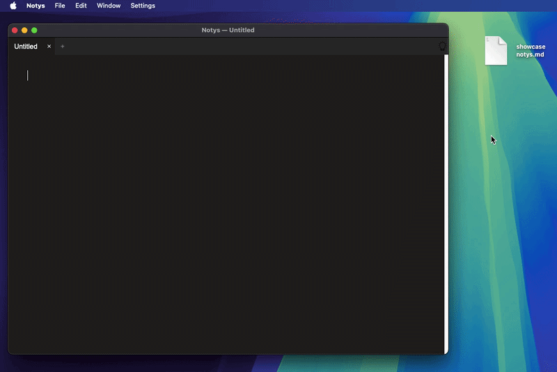

# Notys

**Notys** is an ultra-lightweight note-taking application designed for speed and simplicity.  
No bloat, just the essential features you need to get your thoughts down.

## Features (Markdown-style)

Notys supports real-time formatting using a simple and intuitive syntax:

- **Headers:** Up to 4 levels (using `#`)

- **Bold:** `**text**`

- **Italic:** `*text*`

- **Code Blocks:** ` ```code``` `

- **Text Coloration:** Using the `&^color text^&` syntax.

- **Strikethrough & Highlighting:** For advanced note-taking using ==equals for highlight== and ```~~this for strikethrough~~```.

- **Underline**: using ```-: and :-```

- **Drag & Drop:** Simply drop files into the app to open them instantly.

- **Languages**: There is support for French and English (english by default)

- **Settings**: Various settings for customisation and other.
  
  

  

---

## Getting Started

### For macOS

1. Go to the **Releases** section on GitHub.
2. Download the latest `Notys.zip`.
3. Unzip and move `Notys.app` to your **Applications** folder.
4. Open the app
5. Have fun!

## Work in Progress (Roadmap)

I'm actively working on improving Notys. Here is what's on the stove:
- [ ] **UI Refinement:** Fixing visibility for Underline and Strikethrough in Light Theme.
- [ ] **Responsiveness:** Improving the bottom bar visibility on smaller app dimensions.
- [ ] **Smart Parsing:** Ensuring Markdown syntax only applies to `.md` and not to other files (maybe gonna put something to enable or disable that in the settings)
- [ ] **Bug Fix:** Repairing the "Save All" keyboard shortcut (use the Menu Bar for now!).
- [ ] **Visuals:** Redesigning the scroll bar for a more native look.