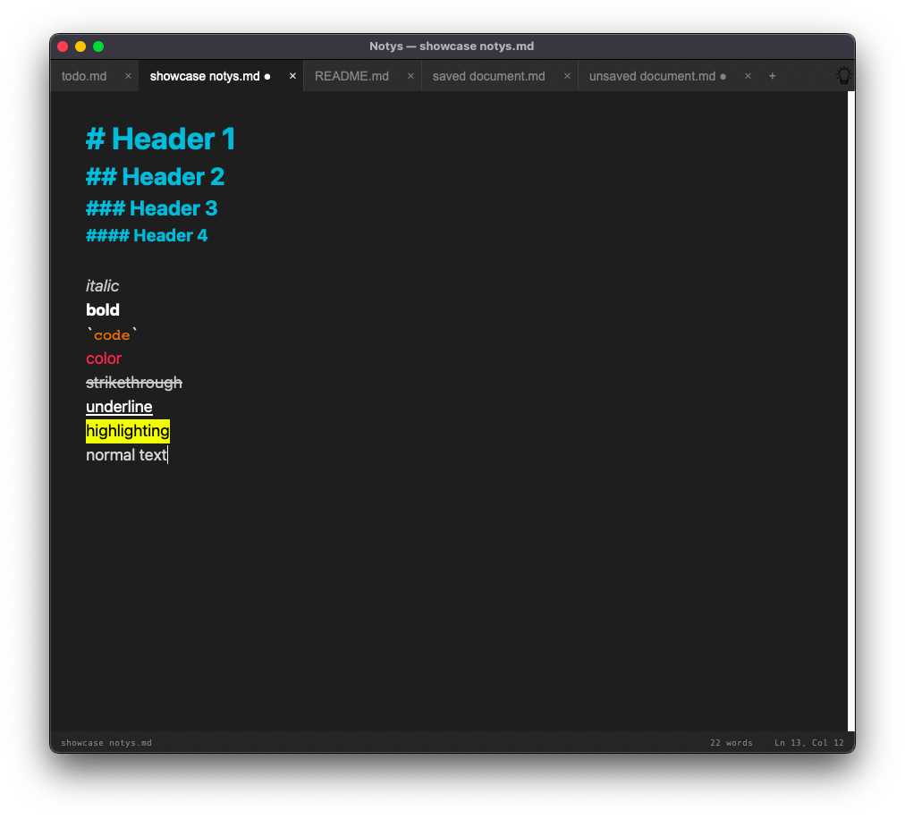

# Notys

**Notys** is an ultra-lightweight note-taking application designed for speed and simplicity.  
No bloat, just the essential features you need to get your thoughts down.

## Features (Markdown-style)

Notys supports real-time formatting using a simple and intuitive syntax:

- **Headers:** Up to 4 levels (using `#`)

- **Bold:** `**text**`

- **Italic:** `*text*`

- **Code Blocks:** ` ```code``` `

- **Text Coloration:** Using the `&^color text^&` syntax.

- **Strikethrough & Highlighting:** For advanced note-taking using ==equals for highlight== and ~~this for strikethrough~~.

- **Underline**: using ```-: and :-```

- **Drag & Drop:** Simply drop files into the app to open them instantly.

- **Languages**: There is support for French and English (english by default)

- **Settings**: Various settings for customisation and other.
  
  

  

---

## Getting Started

### For macOS

1. Go to the **Releases** section on GitHub.
2. Download the latest `Notys.zip`.
3. Unzip and move `Notys.app` to your **Applications** folder.
4. Open the app
5. Have fun!

## Known issues

- Underline is not visible (at all) in light theme, and strikethrough is visible but not good looking (also in light theme).
- Bottom bar (for informations like "words", the line etc...) is not visible if the height resolution is not enough.
- Even non-markdown files will have the markdown syntax.
- The shortcut to save all is not working, but the button in the menu bar is (please use that instead while i am working on the issue).
- The scrolling bar is not very looking like a scrolling bar
