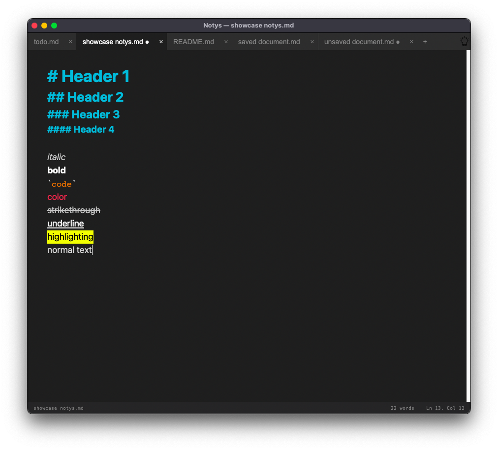
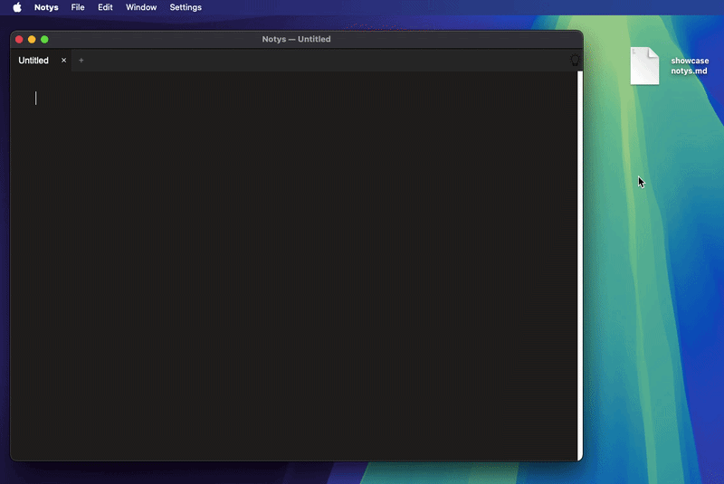

# Notys

**Notys** is an ultra-lightweight note-taking application designed for speed and simplicity.  
No bloat, just the essential features you need to get your thoughts down.

## Download
The latest version of Notys (v1.1.2.1) is currently available for:

*Compatibility note: The macOS files included here were used to build the 1.1.1 release. main.py and the development playground are up to date, but the other files correspond to the older Intel macOS version and may not work correctly with the latest source code.*

**Linux:**

*Notys relies on recent libraries. Non-rolling release distributions aren't officially supported, Arch Linux based distributions are recommended. You can try it anyways, it may work depending on your distro's library versions.*
- AppImage (Recommended, see "Get started" for more informations)
- .zip and run in the .venv
- Source code

**Windows:**

(Windows is not officially supported, no build has been published for Windows yet)
- Source code

**macOS (INTEL ONLY!)**:

- .zip to extract the .app file
- Source code

## Features (Markdown-style)

Notys supports real-time formatting using a simple and intuitive syntax:

- **Headers:** Up to 4 levels (using `#`)

- **Bold:** `**text**`

- **Italic:** `*text*`

- **Code Blocks:** `````code`````

- **Text Coloration:** Using the `&^color text^&` syntax.

- **Strikethrough:** `~~strikethrough~~`

- **Highlight:** `==highlight==`

- **Underline**: using ```-: and :-```

- **Drag & Drop:** Simply drop files into the app to open them instantly.

- **Languages**: There is support for French and English (English by default)

- **Settings**: Various settings for customization and more.
  
  

  

---

### What's behind the scenes?
Behind the scenes, Notys uses simple and lightweight technologies to do what it does.
It is built with Python, Tkinter (for the main window and some utilities), tkinterdnd2 (drag n drop support), Pillow (image/icon management), and JSON (to save the settings even when you restart the app).

Notys has been built mainly with the help of AI (such as Gemini, Claude, Copilot in GitHub and chatGPT). I (human) test it manually, imagine features and design prompts.

README has been through chatGPT to correct typos as I am not an English native speaker.

---

## Getting Started

### For macOS (Intel ONLY!)
**Quick precision, Notys WILL not work on Macs with Apple Silicon (M1, M2, M3, etc.) or on the MacBook Neo. Notys was built and tested on Intel Macs, including Hackintosh systems.**
*macOS support was originally planned to be dropped after v1.1.1. However, I rebuilt the v1.1.2 codebase to create v1.1.2.1, which is identical to v1.1.2 while retaining Intel macOS support.*

1. Go to the **Releases** section on GitHub and navigate to the latest version that supports macOS (v1.1.2.1).
2. Download the latest `Notys.zip`.
3. Unzip and move `Notys.app` to your **Applications** folder.
4. Open the app
5. Have fun!

### For Linux
*Linux is supported, but only on distributions with sufficiently recent library versions. Arch-based distributions are strongly recommended. Older/non-rolling distributions may encounter compatibility issues.*
1. Go to the **Releases** section on GitHub and navigate to the latest release available.
2. Download the .AppImage file.
3. Run "chmod +x path/to/your/appimage"
4. Then run it.

### For Windows
Unfortunately, Windows does not have .exe yet so if you want Notys on Windows, you will have to run it from the .py file or compile it yourself, but i haven't tried both of these options. So, good luck! 🫡️ 

## Work in Progress (Roadmap)

I'm actively working on improving Notys. Here's what I'm currently working on:
- [ ] **UI Refinement:** Fixing visibility for Underline and Strikethrough in Light Theme.
- [ ] **Responsiveness:** Improving the bottom bar visibility on smaller app dimensions.
- [ ] **Smart Parsing:** Ensuring Markdown syntax only applies to `.md` and not to other file types (maybe gonna put something to enable or disable that in the settings)
- [ ] **Bug Fix:** Repairing the "Save All" keyboard shortcut (use the Menu Bar for now!).
- [ ] **Visuals:** Redesigning the scroll bar for a more native look.
- [x] **Settings Improvements**: Fixing the fact that modified settings are reset after a re-launch of the app.

## Known bugs
### Major Bugs
- [ ] **Closing unsaved tabs:** There's a bug only on Linux where when you try to close an unsaved tab, the pop-up will not appear and you can't close the tab.
*How to fix*: Build from source or run directly from the main.py
### Minor Bugs
- [ ] **Scrolling Bar Visibility:** The scroll bar is not very visible nor usable
- [ ] **Light/Dark theme quick button:** The button disappeared in the compiled Linux version 1.1.2.1, while still existing and working in manual non-compiled execution of the main python file and macOS compiled version.
