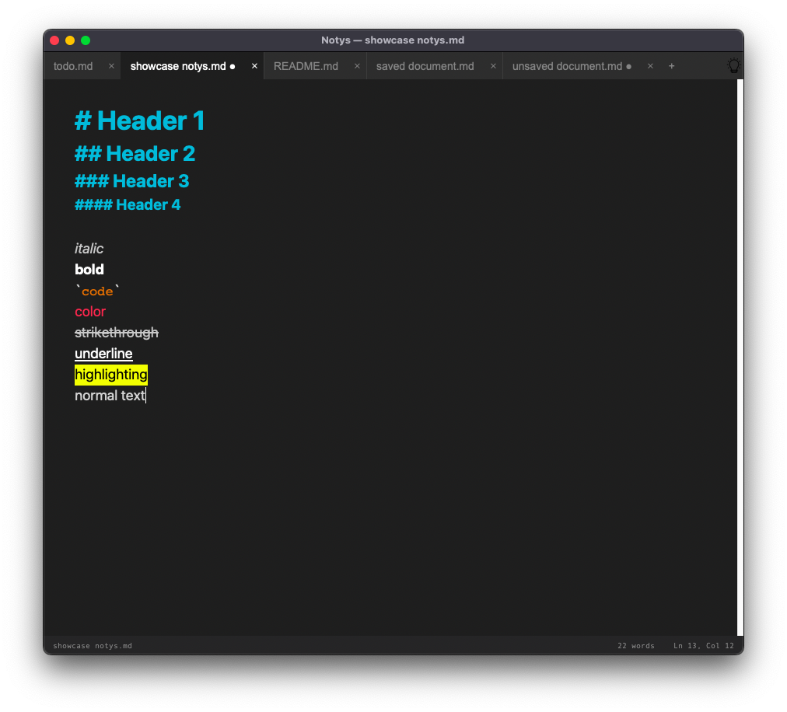
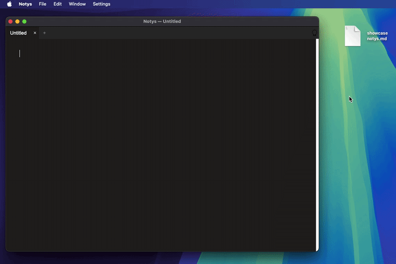

# Notys

**Notys** is an ultra-lightweight note-taking application designed for speed and simplicity.  
No bloat, just the essential features you need to get your thoughts down.

## Download
The latest version of Notys (v1.3.2) is currently available for:

*Compatibility note: The macOS files included here were used to build the 1.1.1 release. main.py and the development playground are up to date, but the other files correspond to the older Intel macOS version and may not work correctly with the latest source code.*

**Linux:**

*Notys relies on recent libraries. Non-rolling release distributions aren't officially supported, Arch Linux based distributions are recommended. You can try it anyways, it may work depending on your distro's library versions.*
*Notys will no longer be updated for linux, therefore the latest ""working"" (it was so buggy and hard to maintain i dropped support) is 1.1.2. I will still put the linux 1.1.2 versions in the newer version.*
- AppImage (Recommended, see "Get started" for more information)
- .zip and run in the .venv
- Source code

**Windows:**

(Windows is not officially supported, no build has been published for Windows yet)
- Source code

**macOS (INTEL ONLY!)**:

- .zip to extract the .app file
- Source code (to use the source code, you will need [this file](https://github.com/darealzoko/Notys/releases/download/v1.1.2.1/Notys.macOS.build.env.zip) and [Python 3.12](https://www.python.org/ftp/python/3.12.4/python-3.12.4-macos11.pkg) and to activate the .venv with `source .venv/bin/activate` or `python3 -m pip install --upgrade pip && python3 -m pip install -r requirements.txt`)

## Features (Markdown-style)

Notys supports real-time formatting using a simple and intuitive syntax:

- **Headers:** Up to 4 levels (using `#`)

- **Bold:** `**text**`

- **Italic:** `*text*`

- **Code Blocks:** `````code`````

- **Text Coloration:** Using the `&^color text^&` syntax.

- **Strikethrough:** `~~strikethrough~~`

- **Highlight:** `==highlight==`

- **Underline**: using ```-: and :-```

- **Drag & Drop:** Simply drop files into the app to open them instantly.

- **Languages**: There is support for French and English (English by default)

- **Settings**: Various settings for customization and more.
  
  

  

---

### What's behind the scenes?
Behind the scenes, Notys uses simple and lightweight technologies to do what it does.
It is built with Python, Tkinter (for the main window and some utilities), tkinterdnd2 (drag n drop support), Pillow (image/icon management), and JSON (to save the settings even when you restart the app).

Notys has been built mainly with the help of AI (such as Gemini, Claude, Copilot in GitHub and chatGPT). I (human) test it manually, imagine features and design prompts.

README has been through chatGPT to correct typos as I am not an native English speaker.

---

## Getting Started

### For macOS (Intel ONLY!)
**Quick precision, Notys WILL not work on Macs with Apple Silicon (M1, M2, M3, etc.) or on the MacBook Neo. Notys was built and tested on Intel Macs, including Hackintosh systems.**
*macOS support was originally planned to be dropped after v1.1.1. However, I rebuilt the v1.1.2 codebase to create v1.1.2.1, which is identical to v1.1.2 while retaining Intel macOS support.*

1. Go to the **Releases** section on GitHub and navigate to the latest version that supports macOS (v1.1.2.1).
2. Download the latest `Notys.zip`.
3. Unzip and move `Notys.app` to your **Applications** folder.
4. Open the app
5. Have fun!

### For Linux
*Linux is supported, but only on distributions with sufficiently recent library versions. Arch-based distributions are strongly recommended. Older/non-rolling distributions may encounter compatibility issues.*
*Notys will no longer be updated for linux, therefore the latest ""working"" (it was so buggy and hard to maintain i dropped support) is 1.1.2. I will still put the linux 1.1.2 versions in the newer version.*
1. Go to the **Releases** section on GitHub and navigate to the latest release available.
2. Download the .AppImage file.
3. Run "chmod +x path/to/your/appimage"
4. Then run it.

### For Windows
Unfortunately, Windows does not have .exe yet so if you want Notys on Windows, you will have to run it from the .py file or compile it yourself, but i haven't tried both of these options. So, good luck! 🫡️ 

## Work in Progress (Roadmap)
### Planned for v1.3.3:
- [ ] fix the fact that when you restart notys and you closed the sidebar, is reopens anyway
- [ ] give actual list feeling when creating a list (instead of just a dash, i would like a dot or something...)
- [ ] checkmarks cuz its fun
- [ ] making the # disappear when not selected (ux change)
- [ ] middle click to close a tab
- [ ] fix when you do a cmd+, and maintain it for a bit it just makes more settings windows. and even when ur super fast it does two of them generally (happens on both macOS and Windows 11)
- [ ] an "X" button next to the parent folder opened to close it
- [ ] change keyboard shortcut from CmdOptS for save all to CmdShiftD
- [ ] add under Edit/Édition copy, cut and paste*
- [ ] windows has the same bug on the scrollbar as on macos (it's white even in dark theme, macOS one is fixed tho)
- [ ] fix cursor on macOS (the "click" cursor is the generic cursor of linux)
### Planned in the near or far future:


## Known bugs
### Minor Bugs
- [ ] **Keyboard shortcut:** The "Save All" and "Reopen Last Closed" keyboard shortcuts do not work, use the menu bar instead.
- [ ] **Light/Dark Theme Button**: The dark/light theme button in the tab bar doesn't display the right icon if started in light mode. Still completely usable at 100%. Just a UI bug.
